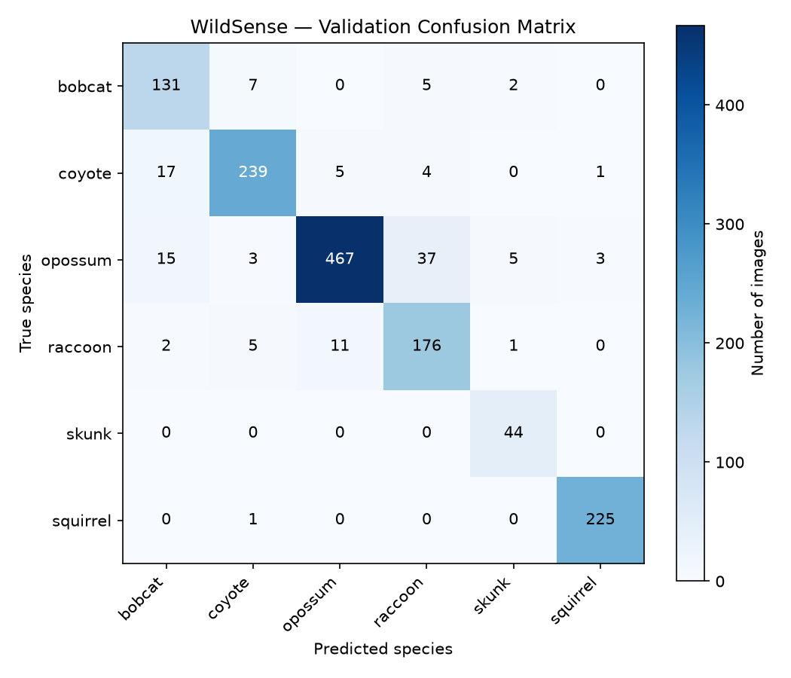

# 🦨 WildSense — AI-Based Species Identification & Population Trend Monitoring

An end-to-end machine learning pipeline that automates species identification from camera trap images, filters out empty/false-trigger frames, logs sightings with geospatial metadata, and surfaces population trend insights through an interactive dashboard — built solo to reduce the manual triage burden that slows down real conservation work.

**[Live Dashboard →](https://your-app-name.streamlit.app)** &nbsp;|&nbsp; **[Live API Docs →](https://wildsense.onrender.com/docs)** &nbsp;|&nbsp; **[Trained Model (Hugging Face) →](https://huggingface.co/Soumybug/wildsense-resnet50)**

> ⏱️ The API is hosted on a free tier and spins down after inactivity — the first request may take 30–60 seconds to wake up.

---

## Why This Exists

Camera traps generate massive volumes of images, and researchers report that a majority of triggers are false positives — wind, shadows, moving vegetation — with no animal present at all. Manually reviewing this footage to identify species and track sightings is slow, error-prone, and delays conservation decisions, especially for under-resourced field teams.

WildSense doesn't try to replace expert ecological analysis. It's scoped specifically to **reduce manual triage burden** and surface patterns — species frequency, sighting trends by time and location — that would otherwise take significant manual effort to compile.

---

## What It Does

1. **Filters** raw camera trap images using Microsoft's MegaDetector, discarding empty/false-trigger frames before they ever reach the classifier
2. **Identifies species** using a fine-tuned ResNet50 classifier (6 species, 0.906 macro F1)
3. **Serves predictions** through a live FastAPI backend, logging every prediction with species, confidence, timestamp, and location
4. **Flags uncertainty** — low-confidence predictions are automatically routed to a "needs review" bucket instead of being logged as confirmed sightings, mirroring how a real deployment would use this as a triage assistant, not an oracle
5. **Visualizes trends** — an interactive dashboard shows sighting density on a map, population trends over time, and activity patterns by time of day

---

## The Journey

This project was built solo, end-to-end, with real debugging along the way rather than a smooth, scripted build. A few of the more interesting problems, because the *process* is as much the point as the result:

- **A silent data bug, not a crash.** Early in Phase 1, a MegaDetector confidence-extraction bug caused every single image to score `0.0` confidence — the script ran without errors and produced a clean-looking CSV, but the numbers were meaningless. Caught only by manually inspecting output, not by any error message. This shaped how the rest of the project was verified: numbers were never trusted without a visual spot-check.

- **A wrong hypothesis, corrected by data.** Based on visual similarity, I initially expected skunk/raccoon to be the model's main confusion pair. The final confusion matrix showed skunk at 100% accuracy (44/44) — weighted loss handled the 12.1x class imbalance better than expected. The real weak point turned out to be bobcat/coyote, a pairing I hadn't anticipated, likely due to similar body shape and coloring in grainy camera trap conditions.

- **An OOM crash that led to a real architecture improvement.** Deploying the FastAPI backend to Render's free tier (512MB RAM) repeatedly crashed under full PyTorch + torchvision's memory footprint, even after removing a redundant pretrained-weights download. Rather than pay for more memory, I exported the trained model to ONNX format and rewrote the inference layer around `onnxruntime` — a deliberate, defensible engineering tradeoff that also happens to be how many real production ML systems separate training-time and serving-time dependencies.

- **Two-stage transfer learning, proven with real numbers, not just theory.** Training only the classifier head (backbone frozen) plateaued at 0.779 macro F1. The moment the full network was unfrozen for fine-tuning at a low learning rate, macro F1 climbed every single epoch to 0.906 — a clean, evidence-backed demonstration of why the extra training complexity was worth it.

---

## Architecture

```
Raw camera trap images (CCT-20, LILA BC)
        │
        ▼
[Phase 1] MegaDetector filtering — discard empty/false-trigger frames
        │
        ▼
[Phase 2] ResNet50 classifier (transfer learning, weighted loss)
        │
        ▼
[Phase 3] FastAPI backend — /predict endpoint, confidence-based triage,
          SQLite logging (species, confidence, timestamp, location)
        │
        ▼
[Phase 4] Trend aggregation — weekly sightings, rolling averages
        │
        ▼
[Phase 5] Streamlit dashboard — map, heatmap, trends, activity patterns
        │
        ▼
[Phase 6] Deployed — Render (API) + Streamlit Community Cloud (dashboard)
          + Hugging Face Hub (model weights)
```

---

## Model Performance

Fine-tuned ResNet50, two-stage transfer learning (frozen head → full fine-tune), weighted loss to address a 12.1x class imbalance.

| Species  | Precision | Recall | F1-score | Support |
|----------|-----------|--------|----------|---------|
| bobcat   | 0.79      | 0.90   | 0.85     | 145     |
| coyote   | 0.94      | 0.90   | 0.92     | 266     |
| opossum  | 0.97      | 0.88   | 0.92     | 530     |
| raccoon  | 0.79      | 0.90   | 0.84     | 195     |
| skunk    | 0.85      | 1.00   | 0.92     | 44      |
| squirrel | 0.98      | 1.00   | 0.99     | 226     |

**Overall accuracy: 0.91 &nbsp;|&nbsp; Macro F1: 0.906 &nbsp;|&nbsp; Weighted F1: 0.91** (validation set, n=1,406)

**Confusion matrix:**



**Training curve (frozen head plateau → fine-tuning improvement):**

| Epoch | Stage | Macro F1 |
|-------|-------|----------|
| 1–5   | Frozen backbone | 0.696 → 0.779 (plateaus) |
| 6–10  | Full fine-tune  | 0.811 → **0.906** |

---

## Dashboard Features

- 🗺️ Interactive map with sighting density heatmap + clustered individual markers
- 🔍 Filters: species, date range, confidence (isolate "needs review" cases)
- 📈 Weekly sighting trends with rolling-average smoothing, per species
- 🕐 Time-of-day activity patterns (nocturnal vs. diurnal behavior)
- 📊 Prediction confidence distribution, visualizing the triage threshold
- 📋 Sortable raw data table with CSV export
- ℹ️ Self-documented limitations panel, so the demo explains its own constraints without requiring anyone to read this README

---

## Tech Stack

| Layer | Tools |
|---|---|
| CV / Preprocessing | OpenCV, Pillow, Microsoft MegaDetector (`pytorch-wildlife`) |
| Model Training | PyTorch, torchvision, scikit-learn, Weights & Biases |
| Model Serving | ONNX Runtime *(converted from PyTorch for lightweight deployment)* |
| Backend | FastAPI, SQLAlchemy, SQLite |
| Trend Analysis | Pandas, Matplotlib, Plotly |
| Dashboard | Streamlit, Folium |
| Deployment | Render (API), Streamlit Community Cloud (dashboard), Hugging Face Hub (model weights) |

---

## Repository Structure

```
WildSense/
├── src/
│   ├── data/           # MegaDetector filtering, metadata pipeline
│   ├── training/        # Model definition, training loop, ONNX export
│   ├── api/              # FastAPI backend, inference, database, seeding
│   ├── analysis/         # Trend aggregation
│   └── dashboard/        # Streamlit app
├── data/processed/       # Cleaned metadata, prediction snapshots
├── results/               # Confusion matrix, classification report, trend charts
├── requirements.txt        # Full local development environment
├── requirements-api.txt    # Lean deployment dependencies (API)
└── src/dashboard/requirements.txt  # Lean deployment dependencies (dashboard)
```

---

## Running Locally

```bash
# Clone and set up
git clone https://github.com/Soumy-bug/WildSense.git
cd WildSense
python -m venv venv
venv\Scripts\activate
pip install -r requirements.txt

# Run the API
uvicorn src.api.main:app --reload

# Run the dashboard (separate terminal)
streamlit run src/dashboard/app.py
```

The API will download trained weights automatically from Hugging Face Hub if not present locally. The dashboard reads live from the local database if available, falling back to a committed CSV snapshot otherwise (this is what powers the deployed version, since free-tier hosting doesn't provide persistent storage for the dashboard).

---

## Known Limitations

Being upfront about where this system currently falls short:

- **GPS coordinates are simulated.** The source dataset (CCT-20) provides camera location IDs, not real GPS. Locations were assigned plausible, consistent fake coordinates for demonstration — not real camera positions.
- **Trend charts show sighting frequency, not population size.** This is a proxy for detection/activity rate, not a population census — genuine population estimates require different methods (e.g. capture-recapture) that account for detection probability.
- **Bobcat/coyote confusion is the model's main weak point** (see confusion matrix), likely due to similar body shape and coloring in camera trap conditions.
- **Rare species have less reliable trends.** Skunk (~200 training images) has noisier, less statistically reliable trend lines than higher-volume species.
- **The deployed dashboard shows a point-in-time data snapshot**, not live predictions, due to free-tier hosting constraints on persistent storage.
- **Free-tier hosting means cold starts.** The API may take up to a minute to respond after a period of inactivity.
- **6 species, southwestern US camera traps only** — the model has not been validated on other ecosystems or species outside this scope.

---

## Acknowledgments

- Dataset: [Caltech Camera Traps (CCT-20)](https://lila.science/datasets/caltech-camera-traps), via LILA BC
- Detection: [Microsoft MegaDetector](https://github.com/microsoft/CameraTraps) via `pytorch-wildlife`
- Beery, S., Van Horn, G., & Perona, P. (2018). *Recognition in Terra Incognita.* ECCV 2018.